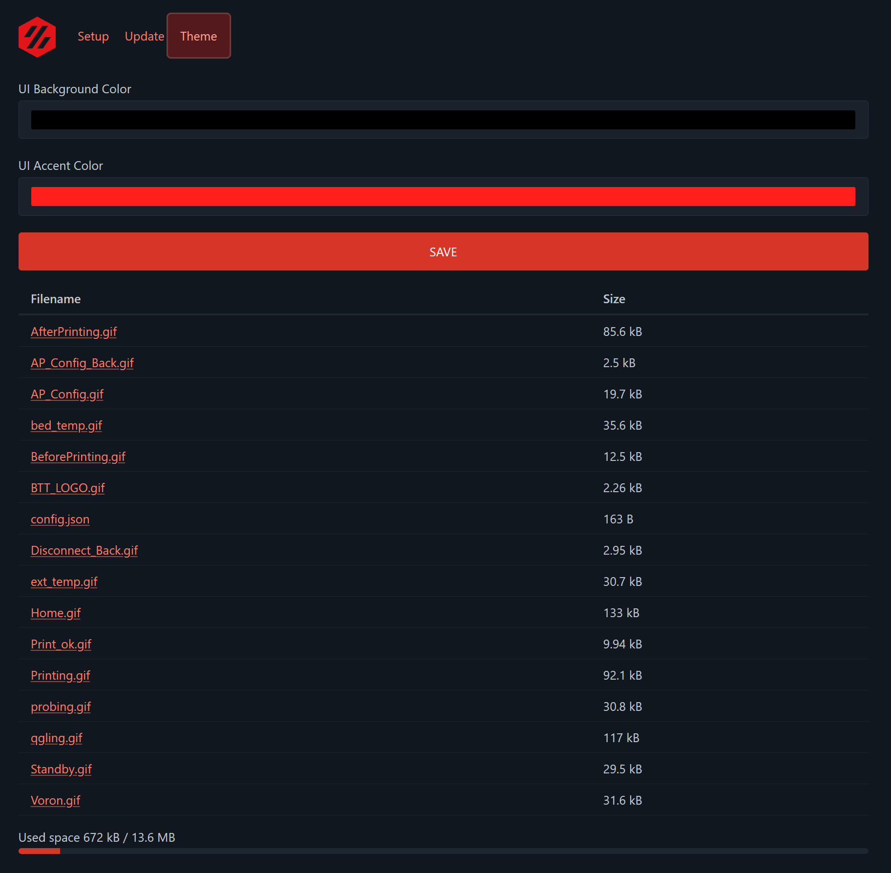
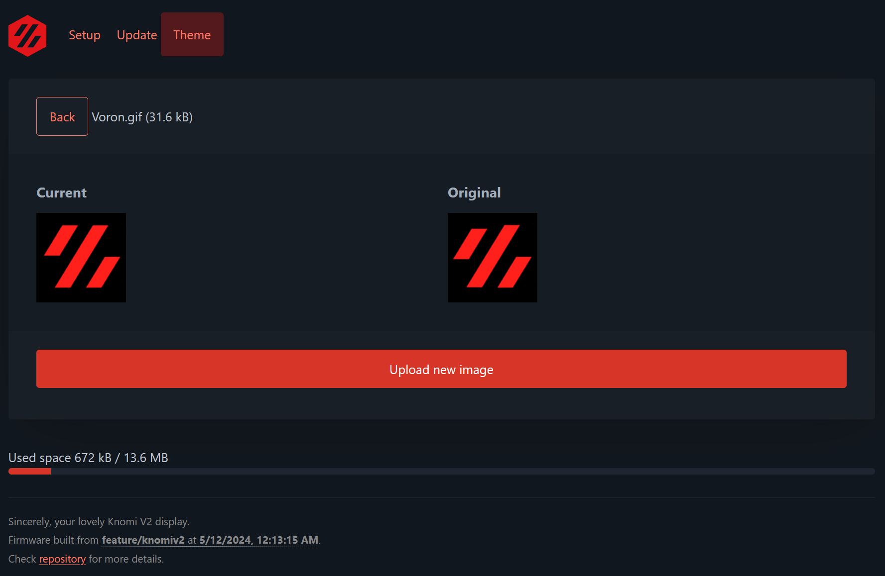

# Compatibility
Currently this firmware supports both KNOMI V1 and KNOMI V2.

# Differences from original KNOMI Firmware

## Pros:

 - Firmware 2 times smaller, enabled OTA (in web browser knomi/update)
 - All images are moved to second partition 
 - Code a lot cleaner, cut all factory-test stuff, switched back to official esp32-arduino platform
 - Nicer webui
 - Can change images using webui without reflashing firmware
 - Any size of gifs are supported on KNOMI V1, even 240x240
 - All communications are async - performance is better
 - Much faster react to klipper updates - thanks to websockets being used instead of polling.
 - Pick your preferred method of print completion percentage (file-relative, file-absolute, slicer, and filament) so Knomi matches mainsail and fluidd.
 - Add an option to not alternate between two images during standby and use only one image - without a flicker!

## Cons:

 - Based on Knomi V1 - meaning no touchscreen / menus on Knomi V2 devices.
 - First setup on iOS is not that nice. Enter "http://KNOMI/" to open initial setup in Safari. On Android / Windows regular captivity portal should open.
 - Unofficial fork - support is on best-effort basis

# Installation

1. Please include "knomi.cfg" from repo to your klipper installation.
You can comment out some sections if you don't have bed mesh or QGL.
2. Connect your KNOMI display directly to PC in flash mode (hold the button and then connect the cable).
3. Download installer from latest release from GitHub releases - it will guide you on first installation. 

# Upgrade

You can download filesystem / firmware from github releases and install them from KNOMI webpage.

If major version changed (1.0.0 -> 2.0.0) - then you MUST update filesystem (theme), it had some incompatible changes.

If minor version changed (1.0.0 -> 1.1.0) - then you can just upgrade firmware, all changes were backwards compatible.

# Web UI screenshots

## Setup page

## OTA page

## Theme page

## Development notes:

For building you need nodejs installed and available on path.
